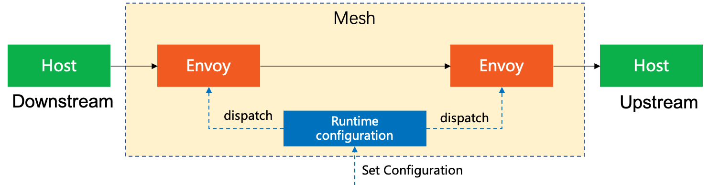
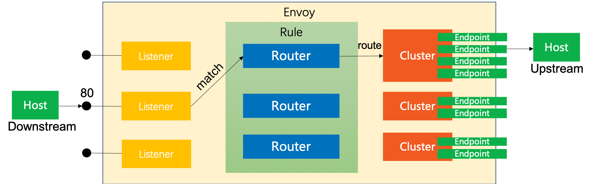
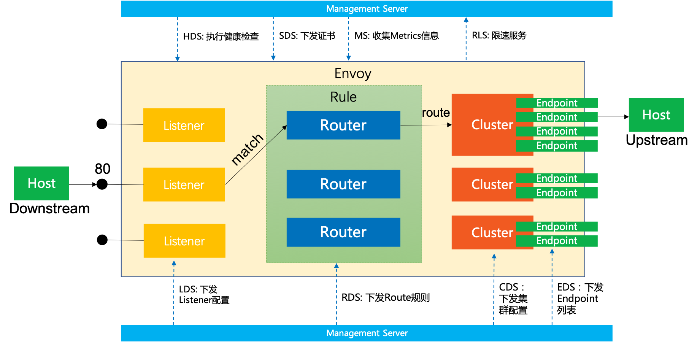

### 基本概念

| Concept               | 概念       | 描述                                                         |
| --------------------- | ---------- | ------------------------------------------------------------ |
| Host                  | 主机       | 能够进行网络通信的实体（如移动设备、服务器上的应用程序）。在Envoy，主机是逻辑网络应用程序。一块物理硬件上可能运行有多个主机，只要它们是可以独立寻址的。 |
| Downstream            | 下游       | 下游主机连接到 Envoy，发送请求并接收响应。                   |
| Upstream              | 上游       | 上游主机接收来自 Envoy 的连接和请求，并返回响应。            |
| Mesh                  | 网格       | 一组主机，协调好以提供一致的网络拓扑。在本文档中，“Envoy mesh”是一组 Envoy 代理，它们构成了分布式系统的消息传递基础，这个分布式系统由很多不同服务和应用程序平台组成。 |
| Runtime configuration | 运行时配置 | 外置实时配置系统，和 Envoy 一起部署。可以更改配置设置，影响操作，而无需重启 Envoy 或更改主要配置。 |

### 请求转发概念

| Concept  | 概念   | 描述                                                         |
| -------- | ------ | ------------------------------------------------------------ |
| Listener | 监听器 | 监听器是命名网地址（例如，端口、unix domain socket等)，可以被下游客户端连接。Envoy 暴露一个或者多个监听器给下游主机连接 |
| Router   | 路由   | 路由是一组将虚拟主机(virtual hosts)与群集(cluster)匹配的规则(rule)，允许您创建流量转移规则 |
| Cluster  | 集群   | 集群是指 Envoy 连接到的逻辑上相同的一组上游主机              |
| Endpoint | 端点   | Envoy将“端点(Endpoint)”定义为群集(Cluster)中可用的IP和端口   |

转发概念示意图如下：

### xDS API概念

| Concept | 全称                          | 描述              |
| ------- | ----------------------------- | ----------------- |
| LDS     | Listener Discovery Service    |                   |
| RDS     | Route Discovery Service       |                   |
| CDS     | Cluster Discovery Service     |                   |
| EDS     | Endpoint Discovery Service    |                   |
| ~~SDS~~ | ~~Service Discovery Service~~ | 改名EDS           |
| ADS     | Aggregated Discovery Service  |                   |
| HDS     | Health Discovery Service      |                   |
| SDS     | Secret Discovery Service      |                   |
| MS      | Metric Service                |                   |
| RLS     | Rate Limit Service            |                   |
| xDS     |                               | 以上各种API的统称 |

在Envoy v2 API中，RDS路由指向集群，CDS提供集群配置，通过EDS发现集群成员。

和xDS相关的其他概念还有：

| 概念              | 描述                                                         |
| ----------------- | ------------------------------------------------------------ |
| Management Server | 实现v2 Envoy API的逻辑服务器。 这不一定是单个物理机器，因为它可以被复制/分片， 并且用于不同xDS API的API服务可以在不同的物理机器上实现。 |

aDS API 示意图如下：

### 区域概念

| Concept  | 概念   | 描述                                                         |
| -------- | ------ | ------------------------------------------------------------ |
| Locality | 局域性 | Envoy实例或端点运行的位置。这包括地域/region，分区/zone和子分区/sub-zone标识。 |
| Region   | 地域   | 分区（zone）所在的地理区域。                                 |
| Zone     | 分区   | AWS中的Availability Zone (AZ), GCP中的Zone                   |
| Sub-zone | 子分区 | Envoy实例或端点在分区内运行的位置。这允许在分区内存在多个负载均衡目标。 |

### 参考资料

- [Terminology](https://www.envoyproxy.io/docs/envoy/latest/intro/arch_overview/terminology): 官方文档中的术语一节
- [Envoy术语](http://www.servicemesher.com/envoy/intro/arch_overview/terminology.html): 上文的中文翻译版本
- [Envoy v2 APIs for developers](https://github.com/envoyproxy/data-plane-api/blob/master/API_OVERVIEW.md): 在这里还补充有其他一些术语

