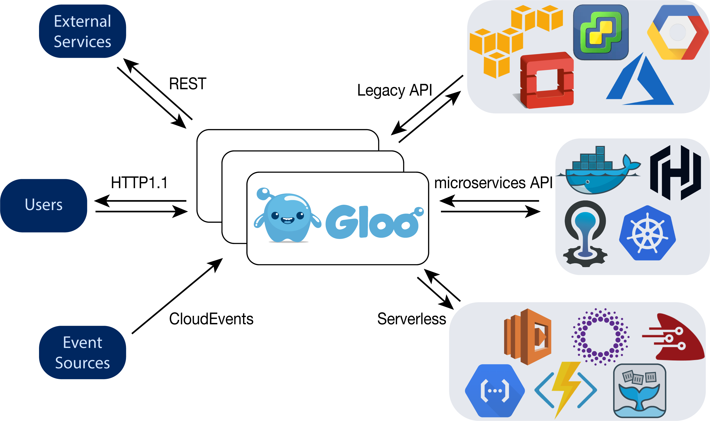

# Gloo

## 介绍

Gloo是一个基于Envoy构建的高性能，可插件扩展，平台无关的API Gateway。 Gloo专为微服务，单体和serverless应用程序而设计。 通过使用功能级路由，Gloo可以在路由级别完全将客户端API与上游API分离。 Gloo充当客户端和上游服务之间的抽象层，允许前端团队独立于微服务团队工作，这些微服务是他们的应用程序要连接到的。

## 特性

**微服务平台与服务发现的集成：**

- Kubernetes
- OpenShift
- HashiCorp Stack (Vault, Consul, Nomad)
- Cloud Foundry

**微服务平台与函数发现的集成：**

- AWS Lambda
- Microsoft Azure Functions
- Google Cloud Platform Functions
- Fission
- OpenFaaS
- ProjectFn

**路由特性：**

- **动态负载均衡**: 跨多个上游服务负载均衡流量
- **健康检查**: 上游服务的主动和被动监控
- **OpenTracing**: 使用广泛支持的 OpenTracing 标准监控请求
- **监控**: 导出 HTTP metrics 到 Prometheus 或 Statsd
- **SSL**: 高度可定制选项，用来添加SSL加密到上游服务，完整支持SNI
- **转换**: 添加，删除，或者修改HTTP请求和应答
- **自动API转换**: 自动转换客户端请求到上游API调用，使用Gloo的函数发现
- **CLI**: 从命令行控制Gloo集群.
- **声明式API**: Gloo具有基于YAML的声明式; 以代码的方式存储配置并和项目提交在一起
- **故障恢复**：Gloo完全无状态，可以在启动时立即返回到所需的配置。
- **可扩展性**：Gloo充当Envoy的控制平面，允许Envoy实例和Gloo实例独立扩展。 Gloo和Envoy都是无状态。
- **性能**：Gloo得益于Envoy的高性能和低资源消耗。
- **插件**：可扩展的架构，用于向Gloo添加功能和集成。
- **工具**: 构建和部署工具，用于自定义构建和部署选项
- **事件**: 使用 CloudEvents 调用API.
- **发布/订阅**: 发布 HTTP 请求到 NATS
- **JSON到gRPC的转码**: 连接JSON 客户端到 gRPC 服务

